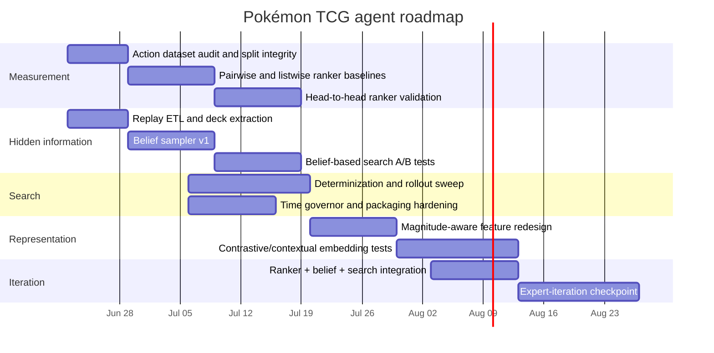
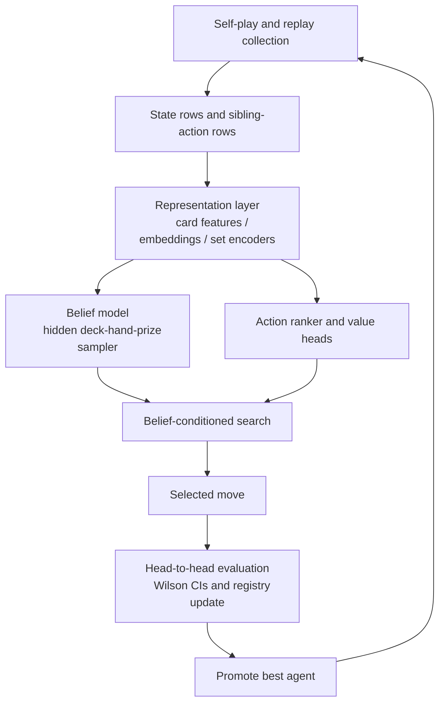

# Pokémon TCG agent research direction report

[Download the Markdown report](sandbox:/mnt/data/pokemon_tcg_research_report.md)  
[Download the PDF report](sandbox:/mnt/data/pokemon_tcg_research_report.pdf)

## Executive summary

The pushed repo now has a coherent research direction, and it is more specific than “keep improving the value model.” The strongest practical baseline is still `agent_search`: forward-model search with a hand-coded leaf evaluation. The living research document says that agent is the current best, at **0.585 vs `first_agent`** and **0.543 vs the heuristic**, while the broader plan document treats hand-search as the best currently validated agent family. The same pushed docs also confirm that the project has already moved beyond plain Monte Carlo outcome supervision: it has run **search-bootstrapped / expert-iteration value passes**, and the repo explicitly says **full policy-gradient RL is not yet done**. citeturn35view0turn36view0turn7view0turn7view1

The repo’s own diagnosis is unusually clear. It argues that the project’s central bottleneck is a **state-value-to-action conversion gap**: the model can predict outcomes from states with useful global signal, but one-ply search needs **local sibling-action discrimination**. The living doc reports that the representation plus model predicts eventual winner at around **AUC 0.74**, and that pass-two search targets reach **Pearson about 0.904**, yet policy strength remains around parity because the learner has mostly been trained to rank states globally rather than rank moves within a decision. The same document notes that about **82% of decisions are real choices**, not forced moves, so the simple deck is not the main bottleneck; the docs explicitly deprioritize “switch to a more complex deck” as the next move. citeturn35view0turn36view0turn7view0turn7view1

The literature that best matches this exact failure mode points in the same direction as the repo. A0GB and related off-policy AlphaZero targets were introduced precisely because plain self-play/search targets can be biased or weak for value learning; those variants trained faster and stronger than the original target on benchmark games. Imperfect-information MCTS work in card games supports **ensemble determinization**, spending budget on **more determinizations**, and being careful not to assume that a “stronger” rollout policy makes search stronger. Recent Magic: The Gathering work supports **contextual preference/ranking objectives** and **magnitude-aware, generalizable card representations**, while more general imperfect-information research such as ReBeL and Student of Games shows where a principled longer-term search-plus-learning stack would lead. citeturn19view0turn12search1turn12search0turn12search17turn23view0turn22view0turn23view1turn19view0turn18view0

The strongest practical recommendation is therefore to treat the repo’s current target as correct: build and validate **sibling-action ranking**, improve **belief-conditioned determinization**, run a disciplined **search-budget sweep** over determinizations, rollout policy, and horizon, and only then push harder into expert iteration or deeper RL. The most interesting speculative line is still the repo’s “pseudo-linguistic” or neuro-symbolic heuristic layer, but the current evidence supports it more as an interpretability or diagnostic layer than as the highest-probability short-term gameplay gain. citeturn35view0turn36view1turn33view0turn33view1turn33view2

## Current repository-grounded state

The pushed repo documents, experiment registry, and working-note file all converge on the same practical picture. The architecture is already layered: card features feed a fixed state encoder; search uses the official forward model; a learned value path exists; replay ingestion and registry discipline exist; and the repo has already registered action-ranking as the current unvalidated frontier. The main plan document is explicit that early misses should not kill the architecture, and that the project should distinguish idea failure from implementation weakness or weak evaluation. citeturn36view0turn36view1turn35view0turn6view0

The consolidated metric picture below is drawn from `docs/RESEARCH.md`, `docs/LEARNING_PLAN.md`, `registry/experiments.jsonl`, and `registry/results.jsonl`. Where the living doc and the registry describe different *stages* of the value-learning branch, I treat the registry as the authoritative measurement surface and the living doc as the current interpretation layer. citeturn35view0turn36view0turn6view0turn7view0turn7view1

| Agent family or experiment | Pushed metric | What it means |
|---|---:|---|
| Heuristic vs random | 0.835 over 200 games | Sanity floor only |
| Hand-crafted board-aware heuristic vs `first_agent` | Near tie in earlier testing | Hand heuristics alone hit a ceiling |
| `agent_search` vs `first_agent` | 0.585 over 800 | Best current practical agent |
| `agent_search` vs heuristic | 0.543 over 800 | Search is the strongest validated edge |
| MC-outcome learned tree value vs heuristic | 0.427 over 400 after correction | Better global prediction did **not** improve move choice |
| Blend / combine v1 vs heuristic | 0.506 over 800 | Useful stabilizer, not a gain lever |
| Search-bootstrapped pass one vs heuristic | 0.517 over 400 | Recovered to parity-like performance |
| Search-bootstrapped pass two vs heuristic | 0.490 over 400 | Better target fit still did not lift play |
| Pass one Pearson to search target | about 0.825 | Value can fit the target moderately well |
| Pass two Pearson to search target | about 0.904 | Fit improved substantially without gameplay gain |

The key interpretive fact is not just that some learned branches lost. It is *why* the repo thinks they lost. `docs/RESEARCH.md` says the policies disagree on a large fraction of real choices while outcomes remain near coinflip, implying most decisions are low-impact and the current learner has not isolated the rare high-impact decisions. The same file explicitly says the untried action objective is now the first priority: stop ranking states and start ranking the legal moves out of a state. That claim is backed by code: `tools/datagen_actions.py` already exists to log every legal option’s leaf features and backed-up value grouped by decision ID, and `agent/search.py` exposes per-option leaf evaluations for exactly this use. citeturn35view0turn25view0turn25view1

The repo is also clear on what is and is not already pushed. The user-mentioned items are **not** merely local notes anymore: the registry contains pass-one and pass-two bootstrap experiments, and the results registry records the pass-two Pearson figure. By contrast, the action-ranking branch is only **partially** pushed in evidence terms: experiment `E013` is registered, and the data-generation code exists, but I did not find a corresponding result entry in `registry/results.jsonl`. So that direction is clearly the current branch, but not yet a validated success or failure. citeturn6view0turn7view0turn7view1turn25view0

A second important repo-grounded conclusion is that the docs now explicitly argue **against** blaming the simple deck for the current plateau. The living doc says the deck already yields a high fraction of genuine decisions, and that adding a more complex deck would multiply decisions without fixing the same value-to-action conversion problem. That is a strong reason to keep the present deck as the main research testbed while using deck swaps only as cheap operational checks, not as the primary research direction. citeturn35view0

## Ranked research questions and scoring rubric

To rank candidate directions without leaning too heavily on unsupported intuition, I recommend a simple 0–5 rubric across five dimensions: **immediate improvement potential**, **long-term upside**, **required engineering cost**, **evidence strength**, and **risk**. A score of 0 means essentially no reasonable case; 3 means credible and worth a disciplined try; 5 means the repo symptom and the external literature match very closely. For engineering cost, higher means harder. For risk, higher means more fragile or more likely to fail even if the idea is interesting. This rubric is a practical decision aid, not a scientific fact claim. citeturn35view0turn36view0

The table below consolidates the open research questions from `docs/RESEARCH.md`, `docs/LEARNING_PLAN.md`, `docs/MODEL_COMMUNICATION.md`, and the registry into ranked *direction clusters* rather than dozens of near-duplicate line items. That is the most practical way to cover the repo’s open questions without losing the structure of H022, H023, H024, the RQ blocks, and the audit questions. citeturn35view0turn36view0turn36view1turn6view0

| Priority | Direction cluster | Repo mapping | Immediate | Upside | Cost | Evidence | Risk | Why it ranks here |
|---|---|---|---:|---:|---:|---:|---:|---|
| Highest | Sibling-action ranking over candidate leaves | H024, current target in `RESEARCH.md`, `datagen_actions.py` | 5 | 4 | 3 | 4 | 3 | Directly addresses the measured bottleneck |
| High | Belief-conditioned determinization and opponent modeling | H022, replay pipeline, hidden-info notes | 4 | 4 | 3 | 4 | 3 | Search is likely capped by naive hidden-state fills |
| High | Search-budget sweep over determinizations, rollout, horizon | H004, H006, H015 | 4 | 3 | 2 | 4 | 2 | Cheap, fast, and unusually well supported by primary sources |
| High | Magnitude-aware card representations and contrastive supervision | RQ1, ideas section, representation notes | 3 | 5 | 4 | 4 | 3 | Strong medium-term foundation for all later models |
| Medium | Multi-target training with option-count and future-options signals | idea 6 | 3 | 4 | 3 | 2 | 3 | Good repo logic, moderate external backing |
| Medium | Agreement-aware ensemble of heuristic, hand eval, value, and search | idea 5, combine-v1 | 2 | 3 | 2 | 3 | 2 | Good stabilizer, but not the core missing piece |
| Medium | Deck/meta quick wins from replay analysis | H018, H020, H021 | 3 | 2 | 1 | 3 | 1 | Cheap operational gain, not the central research bottleneck |
| Lower for now | Opponent-adaptive exploitative policies | H007 | 2 | 4 | 4 | 2 | 4 | Needs belief model and replay scale first |
| Lower for now | Full expert iteration / deeper RL stack | H023 continuation, ReBeL/SoG frontier | 2 | 5 | 5 | 4 | 5 | High upside, but premature before ranker + belief + search knobs are solid |
| Speculative | Neuro-symbolic pseudo-linguistic heuristics | RQ5, idea 4 | 1 | 4 | 4 | 1 | 5 | Interesting and possibly useful, but weakly evidenced for short-run play gains |

The most important question is **sibling-action ranking**. That is because the repo’s central failure mode is now explicitly framed as “good global value prediction, poor local sibling ranking.” The closest external fit is not generic RL literature but the contextual preference/ranking line in collectible card games. In Magic draft, Bertram and colleagues show that selections are best treated as contextual comparisons among available options rather than independent absolute scores, first with contextual preference ranking and then with a contextual InfoNCE objective tailored to one-chosen-versus-many-unchosen settings. That is not the same problem as Pokémon TCG move selection, but it is structurally closer than standard state-value regression because it is explicitly about ranking options within a constrained choice set. The practical protocol is straightforward: build a grouped-by-decision dataset, train pairwise and listwise baselines, test top-1 choice accuracy and NDCG offline, then validate only by head-to-head play against `agent_search` at 800–1600 games with Wilson intervals. The main failure mode is label circularity: if the ranker only learns to mimic one-ply search values determined by a weak hidden-state model, it can inherit the search’s blindness rather than fix it. citeturn35view0turn25view0turn25view1turn23view0turn22view0

The next question is **belief-conditioned determinization**. The repo already says realistic hidden-state seeding is likely the highest-leverage learned component before full RL, and the replay notes say the public replay JSON exposes both players’ decks and can therefore seed search with opponent-informed hidden states. That is strongly supported by prior work. Ensemble determinization for Magic: The Gathering is an unusually direct match and shows that card-game MCTS can gain a great deal from better hidden-state handling. Hearthstone work on predicting opponent moves similarly used card co-occurrence to generate more realistic search assumptions, and recent RBC work shows that information-set weighting can be learned from experience rather than assumed uniform. The practical protocol should therefore start with replay-grounded evaluation, not just gameplay: hold out replays, infer deck/hand/prize distributions from revealed cards and meta priors, then evaluate hidden-card likelihood calibration before integrating the sampler into head-to-head search. The main failure modes are archetype leakage, overfitting to a stale ladder meta, and search slowdown from an overcomplicated belief model. citeturn35view0turn36view1turn12search1turn32view2turn32view1

A third high-priority question is the **search-budget sweep**. This is one of the best-return experiments because the cost is modest and the literature is highly aligned with the repo’s open questions. The repo already cites Cowling-style determinization and the classic MCTS warning that stronger rollouts can make search worse. The practical sweep should vary at least three knobs: determinizations `{4, 8, 16, 32}`, rollout policies `{current aggressive, weak random-biased, default, heuristic-guided}`, and search horizon `{current one-ply-plus-reply, extended horizon}` while holding the rest constant. The key metrics should be win rate, time-budget violations, and tactical reliability on a curated replay slice. The main failure mode is false negatives from too-small `n`; the repo’s own methodology discipline rightly insists that a single noisy run must not kill a component. citeturn35view0turn36view0turn12search1turn12search17turn12search0

A fourth question is **representation quality**, especially magnitude-aware card features and light learned encoders. The repo’s own wording on “draw 2” versus “draw 7” is technically sound: binary tags collapse effect magnitude, optionality, and card-specific semantics. Recent Magic work shows that generalized card representations can dramatically improve generalization to unseen cards while leaving in-sample performance deceptively similar, and the contextual contrastive paper shows that decision-supervised embeddings outperform vanilla CLIP-style formulations in the card domain. The correct evaluation here is not global AUC alone but sibling-ranking strength, held-out tactical-context generalization, and eventual head-to-head play. The main failure mode is building a pretty embedding space that mostly recovers deck identity or archetype rather than move utility; the repo’s current docs are right to warn against pure co-occurrence objectives for this reason. citeturn35view0turn36view1turn23view1turn22view0turn23view0

A fifth question is **multi-target training with option-count and future-options signals**. This idea is one of the more original pieces in the living document: separate “who wins” from intermediate causal structure such as how many options a move preserves or creates. The external evidence is not as direct as for ranking or determinization, so this should be marked as partly speculative. Still, auxiliary-task literature in RL does support the general idea that carefully chosen auxiliary targets can create representations better aligned with downstream control than a sparse end-task reward alone. The practical version should be narrow: log my option count, opponent option count, and one-ply option-count delta; add them as features or auxiliary heads; and test whether they improve sibling ranking or head-to-head play. The main failure mode is learning superficial correlates of tempo rather than genuinely causal futures. citeturn35view0turn30search17turn30search3

The **ensemble / combine** path deserves a lower but nontrivial ranking. The repo has already tried a blend and reported parity, which is useful evidence: combining signals is good as a safety floor but does not appear to be the principal unlock. The best near-term use of ensembling is therefore **agreement-aware control** rather than hoping an average of weak signals becomes strong. When heuristic floor, hand-search, and ranker agree, trust the move and save budget; when they disagree, allocate deeper search. That is a reasonable engineering direction, but it should be treated as a support layer, not the core scientific bet. citeturn35view0turn36view0

The **neuro-symbolic pseudo-linguistic** track should stay alive, but it should be explicitly labeled speculative. There is real literature showing that symbolic or logic-guided policy learning can improve interpretability and sometimes generalization or sample efficiency, including NUDGE, SLATE, and symbolic policy discovery. But there is not yet strong direct evidence that this is the highest-probability short-run route to stronger play in a stochastic, imperfect-information card game. The most realistic version is not open-ended rule discovery. It is distillation or refinement: start from a small rule library of obvious tactical rules, learn when each rule applies and when exceptions dominate, and use the layer mainly as an interpretable policy prior or debugging lens. That framing also lines up well with the lessons in the user’s `structured-transform-discovery` repo, which explicitly concludes that interpretable factor work had more value for diagnosis than for accuracy. citeturn33view0turn33view1turn33view2turn27view0

## Ordered roadmap for the next six to twelve weeks

The recommended sequence is to make the current bottleneck measurable before adding architectural complexity. The repo already has the right discipline language for this: register hypotheses, predeclare sample sizes and surfaces, require honest confidence intervals, and avoid killing ideas on single runs. The roadmap below follows that spirit and keeps the current deck as the primary research environment because the docs explicitly say the simple deck is not the real blocker. citeturn36view0turn35view0

The first block should be **action-ranking infrastructure and baselines**. Use the existing action logger to create a grouped-by-decision dataset of root features, candidate leaf features, search-backed option values, and eventual outcomes. Start with transparent baselines before adding neural encoders: pairwise logistic or Bradley–Terry style models on feature differences, then a simple listwise softmax ranker. The success criterion should be staged. Offline, require better within-decision ranking than current hand-search proxies. Online, require a head-to-head lift over `agent_search` at **800–1600 games** with Wilson intervals and seat alternation, with at least one rerun across a second seed if the effect is borderline. This is the part of the roadmap most directly implied by the repo itself. citeturn25view0turn25view1turn35view0turn36view0

The second block should be **replay-driven belief modeling**. The living doc records that replay download works, that the public JSON contains both players’ decks, and that this should feed opponent-modeled determinization. So the immediate deliverable is not a fancy belief network; it is a replay ETL pipeline that extracts deck frequencies, revealed-card timelines, and hidden-card posterior features. A practical success criterion is two-stage: first improve hidden-card likelihood on replay holdouts, then show a positive A/B head-to-head effect at a fixed search budget. A useful experimental design is to compare three samplers: mirror/self-deck fill, uniform consistent fill, and archetype-conditioned fill. If archetype-conditioned fill wins offline but loses online, that likely means the belief model is overfitting the replay distribution or slowing search too much. citeturn35view0turn36view1turn32view1turn32view2

The third block should be a **search knob sweep** over determinizations, rollout policy, and horizon. This is likely the cheapest high-information branch because the repo’s current defaults are visible and the external literature offers unusually actionable guidance. The experimental matrix should include at least `N_DETERM` values of 4, 8, 16, and 32; rollout policies ranging from weak random-biased to the current aggressive policy; and at least one longer horizon variant. The success criterion is not only win rate but also time-budget stability and tactical consistency on curated replay positions. If one setting improves tactical reliability but not overall head-to-head results, that is still useful because it may pair well with later ranking or belief-model upgrades. citeturn25view1turn12search1turn12search17turn12search0

The fourth block should be **representation upgrades**. Once the ranker and belief path exist, move from coarse hand tags to magnitude-aware card vectors and, if compute permits, a small card-plus-set encoder inspired by contextual preference or contrastive card work. The key methodological rule is to judge representation changes on **generalization and local discrimination**, not merely in-sample fit or global AUC. The docs themselves warn that the current tagging pipeline is too coarse, and the Magic papers show that generalized representations matter most on new or less-seen tactical contexts. The main ablations should therefore be: binary tags only, magnitude-aware engineered features, and a lightweight learned encoder trained with decision supervision. citeturn35view0turn36view1turn23view1turn22view0

Only after those four blocks should the repo commit serious effort to **expert iteration with the action model**. The key change from what has already been tried is that the learner should now improve **move quality within a decision**, not only fit a state value. The practical loop is simple in concept: self-play or replay plus current-best search generates improved action targets; the ranker and value model retrain; the improved models go back into search; and only the best validated checkpoint is promoted. The desired success criterion here is not “higher AUC” but monotone or at least net-positive head-to-head improvement over the current best hand-search baseline. citeturn35view0turn36view0turn19view0

The docs are largely silent on exact wall-clock requirements, so any compute planning must be explicit about assumptions. Based on the current stack, action-data generation, search sweeps, and gradient-boosted baselines are all likely CPU-first tasks. A 12–16 core CPU box should be enough for early self-play and A/B testing. A single consumer GPU in the 8–16 GB range becomes useful once contrastive encoders or larger set encoders enter the loop, but it is not required for the first ranking baselines or for search-budget and determinization sweeps. That estimate is a practical inference from the visible code, not a pushed repo claim. citeturn25view0turn25view1turn25view2turn26view0

The experimental matrix below is designed to keep the program practical rather than sprawling. It also matches the repo’s preference for named surfaces and declared sample sizes. citeturn36view0

| Experiment | Main metric | Sample size target | Required ablations | Success criterion |
|---|---|---:|---|---|
| Sibling ranker baseline | pairwise accuracy, NDCG, top-1 | 30k–100k option rows grouped by decision | pairwise vs listwise; root-only vs leaf-only vs combined features | Offline ranking gain and no head-to-head regression |
| Ranker in search | win rate vs `agent_search` | 800–1600 games | hand-search leaf eval vs ranker vs hybrid | Lower Wilson bound above 0.50 and a practically meaningful gain |
| Belief-conditioned determinization | replay hidden-card likelihood; win rate | 5k–20k replay positions; 800+ games | mirror fill vs uniform-consistent vs archetype-conditioned | Better replay calibration and positive gameplay delta |
| Search knob sweep | win rate, tactic stability, timeouts | 400–800 games per cell | `N_DETERM`, rollout policy, horizon | One simple configuration dominates current defaults |
| Representation upgrade | sibling ranking; head-to-head | same as ranker branch | tags vs magnitude-aware vs learned encoder | Better local ranking with non-negative play impact |
| Expert-iteration checkpoint | head-to-head win rate | 800+ games per checkpoint | pass zero vs pass one vs pass two; with/without belief model | Clear policy improvement, not merely better target fit |

## Medium- and long-term research tracks

The best medium-term architecture is **expert iteration done around an action model rather than a pure state-value model**. ReBeL and Student of Games show the principled endpoint: combine search, learned evaluation, and game-theoretic reasoning for imperfect-information play. But those systems are expensive and conceptually heavier than what the repo currently needs. The realistic medium-term interpretation for this project is more modest: a belief-conditioned search that uses a learned ranker and a calibrated value model to generate better targets, then uses those better targets to sharpen future search. That is very much in the same family, but it avoids prematurely importing full public-belief-state machinery before the local ranking and hidden-state pieces are working. citeturn19view0turn18view0

A second medium-term track is **magnitude-aware learned representation**. This is the most defensible route to scaling beyond the current deck without exploding feature engineering. The repo’s current card taxonomy and engineered features are still useful; the right question is not whether to replace them wholesale, but whether to *refine* them with decision supervision. The Magic literature is particularly relevant because it solves a structurally similar “one preferred item among bounded alternatives” problem and shows that generalized representations matter most under generalization stress, not necessarily on in-sample fit. So the milestone sequence should be: engineered magnitude features first, then a small learned encoder, then ablations on whether the encoder helps sibling ranking and head-to-head play. citeturn23view1turn22view0turn23view0

A third, longer-term track is **neuro-symbolic pseudo-linguistic heuristics**. This remains the least proven but most conceptually distinctive direction. The most defensible research framing is not “this will probably win quickly,” but “this may produce a more interpretable control layer and perhaps a better policy prior.” Modern neuro-symbolic RL work does provide precedent for rule-guided or logic-induced policies that are interpretable and sometimes more sample efficient, and symbolic policy discovery work shows that compact, human-readable policies can sometimes remain competitive. The strongest version of this idea for the repo would be to start from a seeded rule floor—lethal, obvious tempo, avoid immediate self-punish, and so on—then learn the scenario embedding that decides which rule fires and where exceptions should override the floor. That is also the place where the analogy to the user’s `structured-transform-discovery` and `stable-grn-inference` repos is strongest: both stress the value of structured intermediate questions and diagnostic structure instead of trying to map raw observations directly to the final target. Still, in this specific card-game project, that line should be tagged **speculative** until it produces head-to-head evidence. citeturn33view0turn33view1turn33view2turn34search2turn27view0turn27view1

The LOCM and Hearthstone literature also implies a useful caution for the long-term agenda. Heavy RL can absolutely work in short stochastic card games; ByteRL is the clearest example. But the same literature also shows that search-based systems were competitive early, and that learned policies can still be exploitable or brittle. That supports a phased strategy for this repo: use search, belief modeling, and ranking as the near-term strength path; use RL and equilibrium-aware reasoning as the medium- to long-term unification layer after the local tactical engine is already strong. citeturn15search15turn15search3turn15search0turn20search12

## Prioritized bibliography and limitations

The bibliography below is intentionally short and prioritized toward primary sources that are closest to the repo’s current bottlenecks. citeturn35view0turn36view0

**Willemsen, Baier, Kaisers — Value targets in off-policy AlphaZero: a new greedy backup.**  
Best direct literature match for the repo’s main symptom: the problem that a search-learning signal can look good globally while remaining weak for move improvement. The paper introduces A0GB and related targets and reports stronger or faster training than the original AlphaZero-style target on benchmark games. citeturn19view0

**Cowling, Powley, Whitehouse — Information Set Monte Carlo Tree Search.**  
Foundational imperfect-information search reference, especially useful for framing information sets and why perfect-information search intuitions do not transfer cleanly. citeturn12search0

**Cowling, Ward, Powley — Ensemble Determinization in Monte Carlo Tree Search for Magic: The Gathering.**  
Especially important because it is card-game-specific and directly relevant to the repo’s determinization questions. citeturn12search1

**Gelly and Silver — Monte-Carlo Tree Search and Rapid Action Value Estimation in Computer Go.**  
Classic source for the caution that stronger-looking rollout policies can bias search and make it weaker rather than stronger. citeturn12search14turn12search17

**Brown et al. — Combining Deep Reinforcement Learning and Search for Imperfect-Information Games.**  
ReBeL. The best medium-/long-term blueprint for combining search and learning under hidden information, but still too heavy for the repo’s immediate next step. citeturn19view0

**Schmid et al. — Student of Games.**  
Frontier reference on unifying search, self-play learning, and game-theoretic reasoning across perfect and imperfect-information games. citeturn18view0

**Kowalski and Miernik — Summarizing Strategy Card Game AI Competition.**  
Best compact primary survey of LOCM as a card-game AI testbed and the kinds of methods that historically worked there. citeturn15search3turn15search17

**Xi et al. — Mastering Strategy Card Game via End-to-End Policy and Optimistic Smooth Fictitious Play.**  
Important because it proves that heavy RL can succeed in a short stochastic card game, even if it is not the most reliable near-term bet for this repo. citeturn15search15

**Bertram, Fürnkranz, Müller — Predicting Human Card Selection in Magic: The Gathering with Contextual Preference Ranking.**  
The best direct precedent for treating decisions as contextual rankings among bounded alternatives. citeturn23view0

**Bertram, Fürnkranz, Müller — Contrastive Learning of Preferences with a Contextual InfoNCE Loss.**  
Best source for a more modern decision-supervised ranking/embedding objective in a collectible-card-game setting. citeturn22view0

**Bertram, Fürnkranz, Müller — Learning With Generalised Card Representations for Magic: The Gathering.**  
Strong support for magnitude-aware, generalizable card representations, especially under unseen-card or shifted-card-pool conditions. citeturn23view1

**Bertram, Fürnkranz, Müller — Efficiently Training Neural Networks for Imperfect Information Games by Sampling Information Sets.**  
Very relevant for a belief- and value-data budget question: with limited evaluation budget, spread it across more states rather than buying perfect labels on too few. citeturn32view0turn32view3

**Dockhorn et al. — Predicting Opponent Moves for Improving Hearthstone AI.**  
Best direct precedent for replay- or meta-informed hidden-state modeling inside card-game search. citeturn32view2

**Delfosse et al.; Landajuela et al.; Chaudhury et al. — Neuro-symbolic and symbolic policy learning references.**  
Useful for the repo’s pseudo-linguistic heuristic direction, but currently secondary to the ranking and belief-model tracks. citeturn33view0turn33view1turn33view2turn34search2

There are also important limitations to keep explicit. First, the repo’s living doc and registry are aligned on the *diagnosis*, but some numbers refer to different stages of the learned-value branch; the report resolves that by using the registry as the authoritative measurement source when a conflict exists. Second, the action-ranking branch is clearly pushed in code and experiment registration, but not yet in result form, so any claim that it already worked would be premature. Third, the docs do not specify exact wall-clock compute or ladder time semantics, so the roadmap’s compute notes are practical assumptions rather than pushed facts. Finally, the neuro-symbolic track still lacks strong direct evidence in this domain and should be treated as a research hypothesis, not as the mainline plan of record. citeturn35view0turn36view0turn36view1turn6view0turn7view0turn7view1